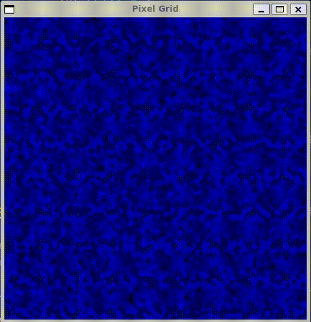
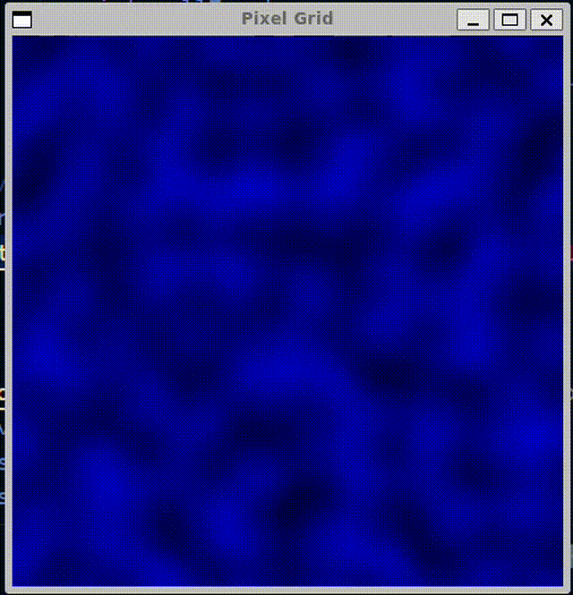

# Overview

This project simulates perlin noise. The project does so by generating a grid of hidden vectors. Then for each point between those vectors we calculate the distance to the vectors and interpolate those values. After smoothing everything out you will get random noise.

The program currently uses 3d vectors in order to calculate the noise. The third dimension allows us to see the noise evolve. The program travels through the third dimention to see the different frames of noise. There is a limit to the number of frames we draw so when we get to the end we loop back allowing the animation to continue.

# Usage

To run the program simply run the [pixles](pixels) file in a lynix environment with SFML installed. The program will prompt the user for detail and vectors per dimension value. The detail is how many pixels are between each vector. The vectors per dimenision allows the user to change how many vectors there are. The detail essentially changes how smooth the noise looks and the number of vectors creates a larger grid which gives you a wider area for noise. Scaling these values up high will take exponentially longer to run.

# Examples

